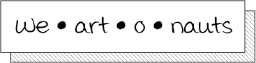

# 

The goal of this [#GLAMhack](https://glam.opendata.ch) project is to enhance the appreciation of art through deeper context. For more background see our website https://we-art-o-nauts.github.io/

To contribute, just download the repository and edit `index.html` in a text editor. There are some resources in the `data` folder, and scripts we depend on in `js`.

**Demo:** [schoolofdata.ch/workshops/2018/weartonauts/](http://schoolofdata.ch/workshops/2018/weartonauts/)

## Background

During the 2018 Open Cultural Data Hackathon at the Swiss National Museum, we were impressed by a huge tapestry that is currently part of the permanent collection - the [Allianzteppich](https://www.nationalmuseum.ch/sammlung_online/?lauftext=DEP-65&sID=&numOf=30&detailID=177198#177198) (nationalmuseum.ch)

The museum people shared all the data available on the object with us, and we further researched information online to create a timeline of events surrounding its creation and history. In particular, [Der Allianzteppich und die Fragen von Selbstdarstellung, Repräsentation und Rezeption](https://www.e-periodica.ch/cntmng?pid=kas-002:2002:53::362) by Sigrid Pallmert was of interest.

Although there is some information on the Wikipedia article [Bildwirkerei](https://de.wikipedia.org/wiki/Bildwirkerei), we could find very little on the technical term [Wollwirkerei](https://de.wikipedia.org/w/index.php?title=Spezial:Suche&search=Wollwirkerei) used in the catalog. The question of how to make information about the methods and history of art objects fascinated our team.

## Tech

We created a spreadsheet using the [Timeline JS](https://timeline.knightlab.com/) template, and our code accesses the document published using Google Docs, so that the timeline could be visualized both in the original "2D form" and our 3D edition.

We are using the Virtual/Augmented Reality toolkit from Mozilla called [A-Frame](https://aframe.io/docs/).

Text-to-speech voiceovers are generated with [Responsive Voice](https://responsivevoice.org/).

## Instructions

1. Download this repository to your computer (e.g. GitHub Desktop) and open the folder with the project.
2. In a command line (Mac: Terminal), go to the project folder using the **cd** (change directory) command, e.g.:
`cd /Users/marinapardini/GitHub/weartonauts`
3. Type a Python command to start a webserver:
`python -m http.server`
4. Make sure the phone and the computer are connected to the same network (`opendatach`)
5. You will see something like "Serving HTTP on 0.0.0.0 port 8000". Open the Web browser on the phone to the address of your network connection (something like 192.168.7.123 instead of 0.0.0.0) but with the appropriate **port number**, e.g. type `192.168.7.123:8000`
6. If everything loads up, you should see a little cardboard icon. Tap it.

# Team

- [Marina Pardini](http://www.marinapardini.com/) (UX designer)
- [Kamontat Chantrachirathumrong](https://github.com/kamontat) (Developer)
- [Xia Willuhn](https://github.com/xwilluhn) (Developer)
- [Oleg Lavrovsky](https://github.com/loleg) (Developer)
- [Birk Weiberg](https://github.com/birk) (Expert)
